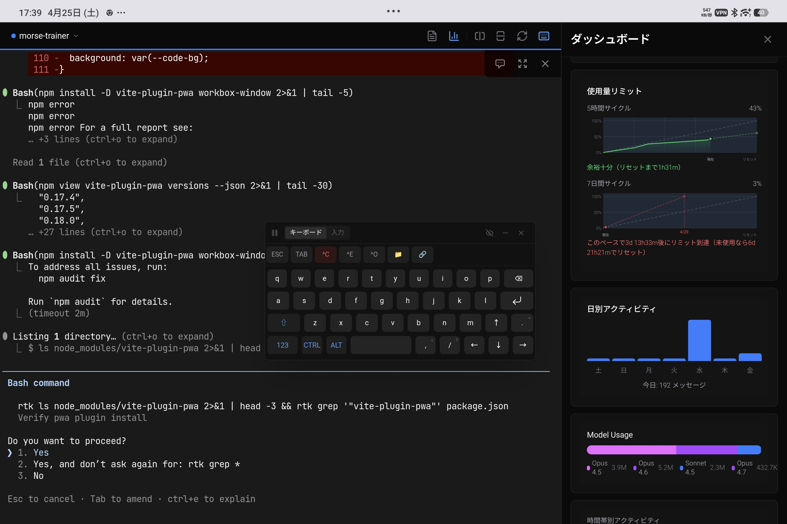
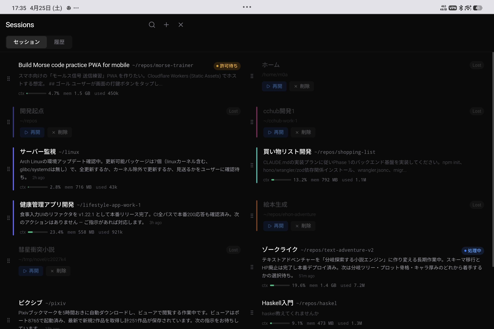
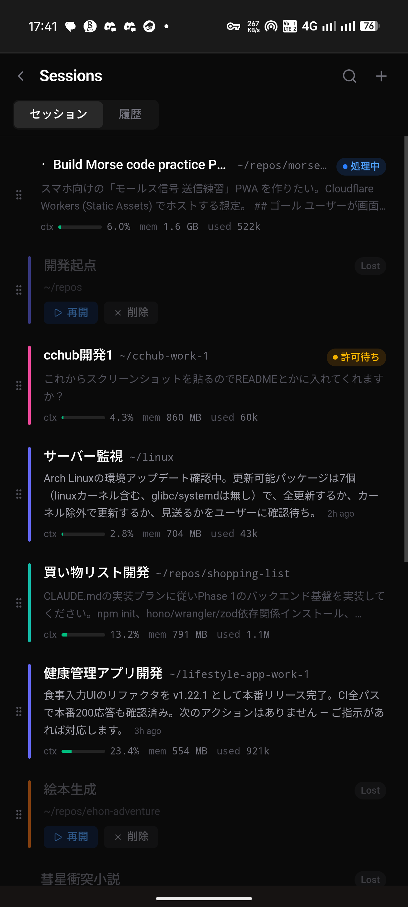
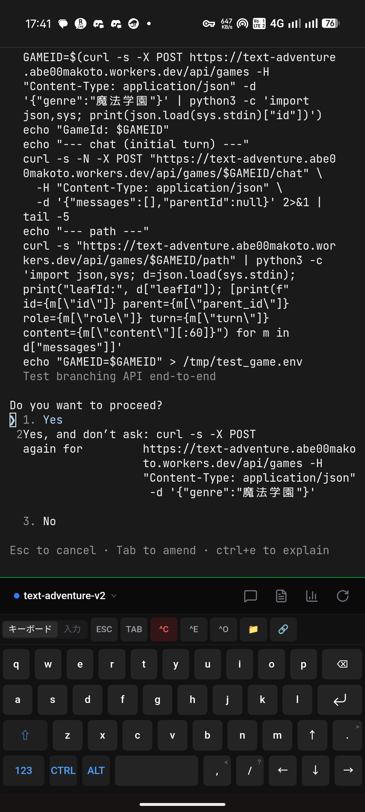

# CC Hub

[日本語](README.ja.md) | English

A web-based terminal manager for remotely managing Claude Code sessions. Control Claude Code from your tablet or smartphone.

## Screenshot



Tablet mode showing multi-pane terminal, floating keyboard, and the dashboard panel (usage limits, daily activity, model usage).



Session list with Claude Code auto-recap, status badges (waiting / processing / lost), context usage, and color-coded themes per session.

&nbsp;&nbsp;

Left: session list adapts to a single-column layout on smartphones. Right: terminal with the custom on-screen keyboard (long-press for symbols, JA toggle for IME).

## Features

- **Multi-session Management** - Run and switch between multiple Claude Code sessions
- **Multi-pane Terminals** - Split panes horizontally/vertically with real-time layout sync across all clients via tmux control mode
- **Pane Operations** - Zoom, resize, focus, close, respawn panes via keyboard shortcuts or session modal UI
- **Team Agent Display** - Shows agent names and colors in pane list and mobile tab bar
- **Session Color Themes** - Assign colors to sessions for visual distinction
- **Desktop Support** - Text selection with auto-copy, font size adjustment (Ctrl+=/-)
- **Tablet-optimized UI** - Split layout, floating keyboard, pinch-to-zoom
- **Mobile Support** - Tap/long-press for custom keyboard, pane tab bar for multi-pane switching, momentum scrolling
- **File Viewer** - Syntax-highlighted code, image, Markdown and HTML preview
- **Change Tracking** - View file diffs from Claude Code edits and git changes (toggle between Claude/Git mode)
- **Browser Back Navigation** - Navigate back through FileViewer states with browser back gesture
- **Tailscale Integration** - Secure HTTPS via Tailscale certificates
- **Password Authentication** - Access control with `-P` option
- **Auto-update** - Automatic updates from GitHub Releases
- **Service Integration** - systemd (Linux) and launchd (macOS) with auto-restart
- **Dashboard** - Usage limits, daily statistics, cost estimates, system metrics, network latency
- **Session History** - Browse and resume past Claude Code sessions with full-text search
- **Conversation Viewer** - Markdown rendering, image display, system summary distinction
- **Prompt Search** - Search across prompt history from all sessions
- **Hook Notifications** - Browser push notifications for Claude Code events (response complete, user input needed)
- **i18n** - English and Japanese UI with automatic language detection
- **Onboarding Walkthrough** - Spotlight-style guide for first-time users

## Installation

### One-line Install (Recommended)

```bash
curl -fsSL https://raw.githubusercontent.com/m0a/cc-hub/main/install.sh | bash
```

### Manual Installation

1. Download the appropriate binary from [Releases](https://github.com/m0a/cc-hub/releases/latest)
   - Linux x64: `cchub-linux-x64`
   - macOS ARM64: `cchub-macos-arm64`

2. Make executable and place in PATH

```bash
chmod +x cchub-linux-x64
mv cchub-linux-x64 ~/bin/cchub
```

3. Add to PATH (if not already configured)

```bash
echo 'export PATH="$HOME/bin:$PATH"' >> ~/.bashrc
source ~/.bashrc
```

## Requirements

| Dependency | Required | Installation |
|------------|----------|--------------|
| [Tailscale](https://tailscale.com/) | Yes | Linux: https://tailscale.com/download / macOS: `brew install tailscale` |
| [tmux](https://github.com/tmux/tmux) 3.0+ | Yes | `apt install tmux` / `brew install tmux` |
| [Claude Code](https://docs.anthropic.com/en/docs/claude-code) | Yes | `npm install -g @anthropic-ai/claude-code` |

## Quick Start

```bash
# 1. Allow Tailscale certificate generation (first time only)
sudo tailscale set --operator=$USER

# 2. Start CC Hub
cchub
# Or with password
cchub -P mypassword

# 3. Access in browser
#    https://<your-hostname>:5923
```

### Register as Service

```bash
cchub setup -P mypassword
```

This enables:
- Auto-start on system boot (systemd on Linux, launchd on macOS)
- Auto-restart on crash
- Auto-update via `cchub update`

## Commands

```bash
# Start server
cchub                        # Start on port 5923
cchub -p 8080                # Specify port
cchub -P mypassword          # Start with password

# Register service (auto-restart, auto-update)
cchub setup -P mypassword

# Update
cchub update                 # Update to latest
cchub update --check         # Check for updates only

# Hook notification (used by Claude Code hooks)
cchub notify                 # Send hook event (reads JSON from stdin)

# Status
cchub status
```

### Options

| Option | Description | Default |
|--------|-------------|---------|
| `-p, --port` | Port number | 5923 |
| `-H, --host` | Bind address | 0.0.0.0 |
| `-P, --password` | Auth password | none |
| `-h, --help` | Show help | - |
| `-v, --version` | Show version | - |

### Tailscale Configuration

First-time setup requires allowing certificate generation:

```bash
sudo tailscale set --operator=$USER
```

> **macOS**: Install via `brew install tailscale`, not the App Store version. The App Store version lacks CLI commands needed for certificate generation.

### tmux Configuration (Optional)

CC Hub works with default tmux settings, but these are recommended:

```bash
# ~/.tmux.conf
set -g mouse on              # Enable mouse support
set -g history-limit 10000   # Increase scrollback history
```

## Usage

1. Open CC Hub in browser
2. Create a Claude Code session with "New Session"
3. Operate Claude Code in the terminal
4. Open file viewer with the file icon

### Keyboard Shortcuts

CC Hub uses tmux control mode (`tmux -CC`) for real-time pane synchronization. All connected clients see the same pane layout.

**Pane & Session Operations**:
| Shortcut | Action |
|----------|--------|
| `Ctrl+B` | Toggle session modal |
| `Ctrl+Shift+B` | Toggle dashboard panel |
| `Ctrl+D` | Split pane vertically (right) |
| `Ctrl+Shift+D` | Split pane horizontally (bottom) |
| `Ctrl+W` | Close pane |
| `Ctrl+Shift+Arrow` | Resize active pane |
| `Ctrl+Shift+=` | Equalize pane sizes |
| `Ctrl+Arrow` | Navigate between panes |
| `Ctrl+1-9` | Switch to session by number |

**Font Size & Clipboard (Desktop)**:
| Shortcut | Action |
|----------|--------|
| `Ctrl+=` or `Ctrl++` | Increase font size |
| `Ctrl+-` | Decrease font size |
| `Ctrl+0` | Reset font size to default |
| `Ctrl+C` (with selection) | Copy selected text |
| `Ctrl+V` | Paste from clipboard |

**Session Modal** (`Ctrl+B`): Shows session list with pane count badges. Expand to see individual panes with focus/close/split actions.

### Session Color Themes

Assign colors to sessions for visual distinction:

1. **Long-press** a session in the session list
2. Color selection menu appears
3. Choose from 9 colors (red, orange, amber, green, teal, blue, indigo, purple, pink) + none
4. Terminal background changes to selected color

### Tablet Mode

Automatically switches to tablet layout when screen width >= 640px and height >= 500px:
- Left: Terminal with split pane support (pinch-to-zoom supported)
- Session modal (`Ctrl+B`) for session switching
- Floating keyboard (draggable, minimizable)

**Pinch Zoom**: Pinch with two fingers on the terminal to zoom. UI controls are not affected by zoom.

### Keyboard Features

**Mobile (Smartphone)**:
- **Tap** or **long-press** terminal to show custom keyboard
- OS standard keyboard does not appear
- Scroll to dismiss keyboard

**Floating Keyboard (Tablet)**:
- Drag header to move position
- Minimize button for compact view
- Position saved separately for Japanese and keyboard modes

**Key Operations**:
- **Long-press** - Symbol input on number keys (1->!, 2->@, etc.)
- **JA** - Switch to Japanese input mode (uses OS standard IME)
- **ABC** - Return to keyboard mode

### Dashboard

View the following in the "Dashboard" tab:

- **Usage Limits** - 5-hour/7-day cycle usage rate, time until reset
- **Limit Prediction** - Estimated time to reach limit at current pace
- **Daily Statistics** - Message and session count graphs
- **Model Usage** - Opus/Sonnet token usage comparison
- **Cost Estimate** - Estimated API costs
- **System Metrics** - CPU, memory, swap usage with history graphs
- **Network Latency** - WebSocket round-trip latency

### Session History

Browse past Claude Code sessions in the "History" tab:

- Grouped by project
- View conversation content (Markdown supported)
- Resume sessions (continues with `claude -r`)
- Full-text search across all user messages

### Hook Notifications

Receive browser push notifications when Claude Code completes a response or needs input. Add `cchub notify` to your Claude Code hooks:

```json
{
  "hooks": {
    "Stop": [{ "hooks": [{ "type": "command", "command": "cchub notify" }] }],
    "PreToolUse": [{ "hooks": [{ "type": "command", "command": "cchub notify" }] }],
    "UserPromptSubmit": [{ "hooks": [{ "type": "command", "command": "cchub notify" }] }],
    "PostToolUse": [{
      "matcher": "AskUserQuestion",
      "hooks": [{ "type": "command", "command": "cchub notify" }]
    }]
  }
}
```

Add this to `~/.claude/settings.json`. The CC Hub server must be running. Allow browser notification permissions on first access.

## Development Setup

For development or building from source, [Bun](https://bun.sh/) 1.0+ is required.

```bash
# Install dependencies
bun install

# Start development server
bun run dev
```

Open http://localhost:5173 in browser (development mode).

### Build from Source

```bash
# Build as single binary
bun run build:binary
./dist/cchub
```

### Development Commands

```bash
bun run dev:frontend    # Frontend only
bun run dev:backend     # Backend only
bun run test            # Run all tests
bun run test:e2e        # E2E tests
bun run lint            # Lint all packages
```

## Tech Stack

- **Backend**: Bun, Hono, WebSocket
- **Frontend**: React 19, Vite, Tailwind CSS v4, xterm.js, react-i18next
- **Terminal**: tmux control mode (`tmux -CC`)

## Architecture

An interactive overview of backend services, API routes, frontend components, hooks, WebSocket protocol, shared types and the major data flows lives in [`architecture.html`](architecture.html) (data: [`architecture.json`](architecture.json)).

- Render in your browser via [raw.githack](https://raw.githack.com/m0a/cc-hub/main/architecture.html) — JSON is embedded, no external fetch required.
- Edit `architecture.json` and run `python3 scripts/build-architecture-html.py` to refresh the embed.

## License

MIT
